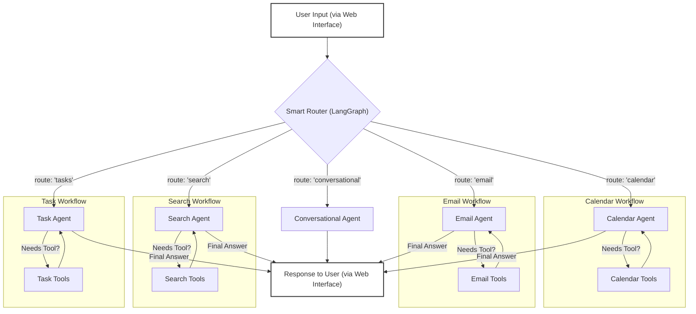

# Personal AI Assistant

A conversational AI assistant web application that connects to your Google services (Calendar, Gmail, Tasks) to help you manage your schedule, communications, and to-do lists. It can also answer general knowledge questions via web search and hold natural, stateful conversations with persistent memory across multiple chat sessions.

This project is built upon an advanced Router Architecture, intelligently delegating tasks to specialized expert agents, all served via a modern web interface.

---

## Architectural Features

- **Full-Stack Application:** Combines a powerful FastAPI backend (Python) handling the AI logic with a sleek Next.js frontend (TypeScript/React) providing the user interface.

- **Advanced Agentic Architecture:** The backend utilizes a "Smart Router" (built with LangGraph) to analyze user requests and delegate tasks to the correct expert: Calendar, Email, Tasks, Search, or Conversational.

- **Specialized Expert Agents:** Each task area is handled by a dedicated agent with its own tools and robust system prompts, ensuring accuracy and adherence to safety protocols.

- **Safe, Multi-Step Workflows:** Critical actions like deleting events, sending emails, or completing tasks require explicit user confirmation, ensuring a safe and predictable user experience.

- **Robust Error Handling:** The assistant is designed to handle API or connection errors gracefully, providing clear feedback to the user (e.g., "I'm having trouble connecting to Google Calendar") instead of crashing.

- **Dynamic Conversation History:** Features a sidebar displaying previous chat sessions. Users can switch between conversations, rename them for better organization, and the assistant maintains context for each session.

- **Persistent Conversation Memory:** Leverages LangGraph's SQLite checkpointer to store conversation state, allowing sessions to be paused and resumed. A separate table stores user-defined chat titles.

- **Conversational AI Core:** Powered by LangGraph and Groq's Llama 3 for stateful, low-latency conversations.

- **Google Calendar Integration:**

  + **Natural Language Understanding:** Parses queries like "tomorrow at 4 PM" or "next week" into precise dates and times, powered by the `parsedatetime` library.
  + **Full Event Management (CRUD):** Can create, read, update, and delete calendar events. It intelligently checks for scheduling conflicts and handles complex requests like "Move my meeting to 5 PM."
  

- **Gmail Integration:**

   + **Intelligent Search & Summarization:** Filters emails by sender, status, keywords, and time range (e.g., "last 2 days") and summarizes their content.

   + **Autonomous Composition:** Can compose and draft emails and replies based on high-level user intent (e.g., "Reply and tell them I'm interested").

   + **Full Email Management:** Can create drafts, send drafts (with user confirmation), archive, and delete emails.


- **Google Tasks Integration:**

   + **Full Task Management:** Allows the user to add, list, update, complete, and delete tasks from their Google Tasks lists.

   + **Natural Language Due Dates:** Understands due dates like "for tomorrow" or "for next Friday" when adding tasks.

- **General Knowledge Q&A:** Uses the Tavily Search API for real-time information retrieval, with mandatory search rule and source citation.

- **Modern Web Interface (Frontend):**

  - Clean, responsive chat interface built with React and styled with Tailwind CSS.

  - Real-time message updates and "Assistant is thinking..." indicators.

  - Sidebar for managing multiple conversations with renaming capabilities.

---

## Architecture Diagram

The assistant operates on a router-based agentic architecture. All user input is first evaluated by a "Smart Router" which then delegates the task to the appropriate specialized expert.



---

## Technologies Used

#### Backend:

- **Framework:** FastAPI

- **AI/Agent Framework:** LangChain & LangGraph

- **LLM:** Groq API (Llama 3 models)

- **Web Server:** Uvicorn

- **Database:** SQLite (for LangGraph checkpoints & chat titles)

- **Key Python Libraries:** google-api-python-client, google-auth-oauthlib, parsedatetime, python-dotenv, Pydantic

#### Frontend:

- **Framework:** Next.js (App Router)

- **Language:** TypeScript

- **UI Library:** React

- **Styling:** Tailwind CSS


#### External Services:

- Google Calendar API

- Google Gmail API

- Google Tasks API

- Tavily Search API


---


##  Setup & Installation

Follow these steps to get your local environment set up and ready to run the assistant.

**1. Clone the Repository:**

```bash
git clone https://github.com/berkyalkn/ai-personal-assistant.git
cd ai-personal-assistant
```

**2. Setup Backend:**

```bash
# Go to the backend directory
cd backend

# Create a virtual environment (recommended)
python -m venv venv
# Activate it (macOS/Linux): source venv/bin/activate
# Activate it (Windows): .\venv\Scripts\activate

# Install required Python packages
pip install -r requirements.txt
```

**3. Create and Configure the `.env` File:**

- In the root of the project, create a new file named `.env`.

-  Copy the contents of the `.env.example` file below into your new `.env` file and fill in your own credentials.


**.env.example:**

```
# Groq API Key for the LLM
GROQ_API_KEY="gsk_YourGroqApiKey"

# Tavily API Key for web search
TAVILY_API_KEY="tvly-YourTavilyApiKey"
```


**4. Configure Google API Access:**

- Go to the [Google Cloud Console](https://console.cloud.google.com/)

- Create a new project.

- Go to "APIs & Services" > "Library" and enable the "Google Calendar API" and the "Gmail API".

- Go to "OAuth consent screen", select "External", and fill in the required app details. Add your own Google account as a "Test user".

- Go to "Credentials", click "+ CREATE CREDENTIALS", and select "OAuth client ID".

- Choose "Desktop app" as the application type.

- After creation, click the "DOWNLOAD JSON" button.

- Rename the downloaded file to `credentials.json` and place it in the root of your project directory.

**Note:** The first time you run a calendar command, you will be prompted to authorize the application in your browser. This will generate a `token.json` file. This is a one-time process.

**Setup Frontend:**

```bash
# Go back to the root directory
cd ..

# Go to the frontend directory
cd frontend

# Install the required Node.js packages
npm install
```

---

##  How to Run

You will need two separate terminal windows to run the application.

#### Terminal 1: Backend Server

```bash
cd backend
# Don’t forget to activate the virtual environment (if you're using one)
# source venv/bin/activate

# Start the FastAPI server
uvicorn main:app_fastapi --reload --port 5001
```

#### Terminal 2: Frontend Server

```bash
cd frontend
npm run dev
```

Once the application has started successfully, you can visit http://localhost:3000 in your browser to start using the AI Personal Assistant.

--- 

## Example Usage

A quick glimpse of the AI Personal Assistant in action:


