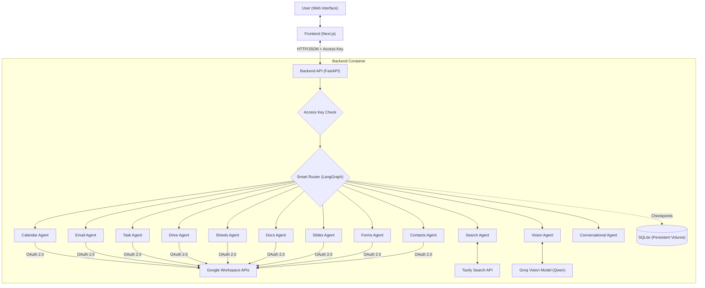

# Personal AI Assistant


A conversational AI assistant that acts as the single control point for your entire Google productivity stack — **Calendar, Gmail, Tasks, Drive, Sheets, Docs, Slides, Forms, and Contacts** — plus live web search and image understanding, all through one chat interface. It's built as a multi-agent system with LangGraph: a "Smart Router" reads what you're asking for and hands the request to a specialized expert agent that knows exactly which Google API calls to make.

Think of it as one assistant that can see and act across your entire connected Google ecosystem — instead of switching between nine different apps, you just say what you want.

---

## Table of Contents

- [What it can do](#what-it-can-do)
- [Architecture](#architecture)
- [Tech Stack](#tech-stack)
- [Setup Guide](#setup-guide)
  - [1. Clone & Install](#1-clone--install)
  - [2. Connecting Your Google Ecosystem](#2-connecting-your-google-ecosystem)
  - [3. Environment Variables](#3-environment-variables)
  - [4. Run It Locally](#4-run-it-locally)
  - [5. First-Time Google Login](#5-first-time-google-login)
- [Using the Assistant — Example Prompts](#using-the-assistant--example-prompts)
- [Security: Locking the App to Only You](#security-locking-the-app-to-only-you)
- [Personalizing the UI (Themes & Backgrounds)](#personalizing-the-ui-themes--backgrounds)
- [Deployment Options](#deployment-options)
  - [Option A — Cloudflare Tunnel (fastest, free, keeps data local)](#option-a--cloudflare-tunnel-fastest-free-keeps-data-local)
  - [Option B — Docker Compose (local, containerized)](#option-b--docker-compose-local-containerized)
  - [Option C — Red Hat OpenShift (production-style cloud deploy)](#option-c--red-hat-openshift-production-style-cloud-deploy)
- [Known Limitations](#known-limitations)
- [Example Usage](#example-usage)
- [Author](#author)

---

## What it can do

The backend is a LangGraph state machine with **11 expert nodes**. A router model classifies every message and sends it to the right expert — each expert only has the tools relevant to its domain, which keeps responses focused and prevents the model from calling the wrong API.

| Domain | Agent capabilities |
|---|---|
| 📅 **Calendar** | List/search events by day or range, find free time slots, create events (with automatic conflict checking), update, and delete — all from natural language like "next Tuesday at 4pm". |
| 📧 **Gmail** | Search by sender/subject/keyword/status/time range, read summaries, create and send drafts, reply to threads, archive, and delete — always drafts first and asks for confirmation before sending. |
| ✅ **Tasks** | List, add (with natural-language due dates), update, complete, and delete tasks across your Google Tasks lists. |
| 📁 **Drive** | Search files, list recently modified files, create folders, share files/folders with specific people, delete files. |
| 📊 **Sheets** | Create new spreadsheets, read cell ranges, overwrite ranges, append rows. |
| 📄 **Docs** | Create new documents (with initial content), read full document text, append text to existing docs. |
| 📽️ **Slides** | Create new presentations, add slides with title/body text, list existing slides. |
| 📝 **Forms** | Create new forms, add questions (short answer, paragraph, multiple choice, checkbox), read a form's structure, list submitted responses. |
| 👤 **Contacts** | Search contacts, list contacts, resolve a name to an email address (handy right before sending an email or inviting someone to an event). |
| 🔍 **Search** | Real-time web search via Tavily, with mandatory source citation — never answers factual questions from memory alone. |
| 🖼️ **Vision** | Attach an image in the chat and ask about it — object/scene description, reading text in the image, etc. Routed automatically to a vision-capable model whenever an image is attached. |

**Safety by design:** every destructive or irreversible action (deleting an event, sending an email, deleting a Drive file, deleting a task) requires the agent to first identify the exact item, state what it's about to do, and get explicit confirmation from you before acting.

**On top of that:**
- **Smart, LLM-generated chat titles** — instead of just truncating your first message, a lightweight model reads the opening exchange and names the conversation something meaningful (e.g. asking about tigers gets titled *"Tiger Habitat and Diet"*, not `"tell me about tige..."`).
- **Markdown-rendered responses** — tables, bold text, bullet lists, and code blocks render properly instead of showing raw `**`/`|` syntax.
- **8 visual themes** (Aurora, Ocean, Cosmos, Metropolis, Sunset, Wildlife, Rajasthan, Desert) — each with its own rotating background photo set and accent color, switchable from a floating theme picker.
- **Password-gated access** — the whole app (including direct API access) requires a shared secret, so a public link can't be used by strangers to touch your Google account. See [Security](#security-locking-the-app-to-only-you).

---

## Architecture



Each domain agent is its own LangGraph node with a dedicated system prompt and its own bound tool set — the router never lets, say, the Calendar agent accidentally call a Gmail tool.

---

## Tech Stack

**Backend:** FastAPI · LangChain & LangGraph · Groq API (`openai/gpt-oss-120b` for reasoning/tool-use, `qwen/qwen3.6-27b` for vision) · Uvicorn · SQLite (LangGraph checkpoints + chat titles) · Pillow (image resizing) · `google-api-python-client` / `google-auth-oauthlib` · `parsedatetime` · Pydantic

**Frontend:** Next.js (App Router) · TypeScript · React · Tailwind CSS · `react-markdown` + `remark-gfm` (formatted responses)

**Infrastructure:** Docker & Docker Compose · OpenShift/Kubernetes manifests · Nginx (frontend container) · Cloudflare Tunnel (free public exposure without cloud hosting)

**External services:** Google Calendar, Gmail, Tasks, Drive, Sheets, Docs, Slides, Forms, and People (Contacts) APIs · Tavily Search API

---

## Setup Guide

### 1. Clone & Install

```bash
git clone https://github.com/jeorgeiiii/ai-personal-assistant.git
cd ai-personal-assistant

# Backend
cd server
python -m venv venv
venv\Scripts\activate        # Windows
# source venv/bin/activate   # macOS/Linux
pip install -r requirements.txt

# Frontend
cd ../client
npm install
```

### 2. Connecting Your Google Ecosystem

This is the part that turns "a chatbot" into "your connected assistant." You need one Google Cloud project with 9 APIs enabled and an OAuth client.

<details>
<summary><strong>Click to expand: full Google Cloud Console walkthrough</strong></summary>

**Step 1 — Create (or pick) a project**
Go to [console.cloud.google.com](https://console.cloud.google.com/), and create a new project (or select an existing one) from the project dropdown at the top.

**Step 2 — Enable the APIs**
Go to **APIs & Services → Library** and enable each of these individually (search the name, click it, click **Enable**):
- Google Calendar API
- Gmail API
- Tasks API
- Google Drive API
- Google Sheets API
- Google Docs API
- Google Slides API
- Google Forms API
- **People API** (this is what powers Contacts — it's a different product from the deprecated "Contacts API," don't confuse the two)

**Step 3 — Configure the OAuth consent screen**
Go to **APIs & Services → OAuth consent screen** (labeled "Google Auth Platform" in newer Console UI):
- Choose **External** (or **Internal** if you're on a Google Workspace org) and fill in the basic app info.
- Under **Test users**, add your own Google account. While the app is in "Testing" publishing status, only listed test users can complete the OAuth flow — skip this and you'll hit an "Access blocked" error.

**Step 4 — Add the scopes**
Still on the consent screen, go to **Data Access → Add or remove scopes**, filter for each API name, and check the corresponding scope:

| Filter for | Scope to check |
|---|---|
| Calendar | `.../auth/calendar` |
| Gmail | `.../auth/gmail.modify` |
| Tasks | `.../auth/tasks` |
| Drive | `.../auth/drive` |
| Sheets | `.../auth/spreadsheets` |
| Docs | `.../auth/documents` |
| Slides | `.../auth/presentations` |
| Forms | `.../auth/forms.body` and `.../auth/forms.responses.readonly` |
| Contacts/People | `.../auth/contacts.readonly` |

Click **Update**, then **Save**.

**Step 5 — Create the OAuth Client ID**
Go to **APIs & Services → Credentials → Create Credentials → OAuth Client ID**.
- Application type: **Desktop app**.
- Once created, download the JSON.
- Rename it to `credentials.json` and place it inside the `server/` directory.

**Step 6 — Redirect URI**
This project's OAuth flow runs a temporary local server on port `8090` to catch the redirect. Since it's a "Desktop app" client type, Google allows `http://localhost` redirects automatically — no manual redirect URI configuration needed for local use.

</details>

Once this is done, `server/credentials.json` should exist and all 9 APIs + scopes are ready. You do **not** need to manually generate `token.json` — the app creates it automatically the first time it needs to talk to Google (see [First-Time Google Login](#5-first-time-google-login)).

### 3. Environment Variables

Create `server/.env`:

```bash
GROQ_API_KEY="gsk_YourGroqApiKey"       # https://console.groq.com — free tier available
TAVILY_API_KEY="tvly-YourTavilyApiKey"  # https://tavily.com — free tier available
ACCESS_KEY="choose-a-strong-password"   # locks the whole app down, see Security section
```

Optionally, create `client/.env.local` if your backend won't be reachable at `http://127.0.0.1:5001` (e.g. deploying, or using a tunnel):

```bash
NEXT_PUBLIC_API_URL=https://your-backend-url
```

### 4. Run It Locally

```bash
# Terminal 1 — backend
cd server
venv\Scripts\python -m uvicorn main:app_fastapi --host 0.0.0.0 --port 5001

# Terminal 2 — frontend
cd client
npm run dev
```

Open **http://localhost:3000**.

### 5. First-Time Google Login

The first time any Google-connected tool actually runs (e.g. you ask "what's on my calendar?"), the backend will print an authorization URL to its terminal — it can't open a browser automatically. Copy that URL, open it, sign in with the Google account you added as a test user, and approve all the requested permissions. It redirects to `localhost:8090`, and `server/token.json` is created automatically. From then on, you won't need to log in again unless the token is revoked or deleted.

---

## Using the Assistant — Example Prompts

Once connected, here's what a "complete ecosystem" actually looks like in practice — you can move across all of these in a single conversation:

```
"What's on my calendar this week?"
"Schedule a call with jane@example.com tomorrow at 3pm for 30 minutes"
"Find a free 1-hour slot tomorrow between 9am and 5pm"

"Show me unread emails from my manager"
"Draft a reply saying I'll have it ready by Friday"

"Add 'renew passport' to my tasks, due next Monday"
"What tasks do I have left?"

"Search my Drive for the Q3 report"
"Create a folder called Client Onboarding"
"Share that file with someone@example.com as a viewer"

"Create a spreadsheet called Monthly Budget"
"Read A1:D10 from that sheet"

"Create a doc called Meeting Notes and write 'Agenda: ...' in it"

"Create a presentation called Team Update"
"Add a slide titled 'Q3 Results'"

"Create a form called Customer Feedback"
"Add a multiple choice question asking how satisfied they are"

"What's Sarah's email address?"

[attach a photo] "What's in this image?"

"What's the latest news on the James Webb telescope?"
```

The Smart Router figures out which expert handles each message — you never need to specify which "mode" you're in.

---

## Security: Locking the App to Only You

This is a **single-user** assistant — one Google account, one `token.json`, tied to whoever set it up. That means anyone with the URL could otherwise read/send your email, edit your calendar, or delete your files just by chatting with it. To prevent that, every real API endpoint is protected by a shared access key, enforced **on the backend itself** — not just hidden in the UI — so it can't be bypassed by calling the API directly instead of the website.

- Set `ACCESS_KEY` in `server/.env` to whatever password you want.
- On first visit, the frontend shows a lock screen. Enter the password once per browser — it's remembered after that via `localStorage`.
- Anyone without the correct key gets blocked with: *"Sorry Only Prince Mehra can use this website"*.
- To change the password later, just update `ACCESS_KEY` in `.env` and restart the backend — anyone with the old password (including your own other browsers) will be automatically re-locked.

⚠️ This is a simple shared-secret gate, not full multi-user authentication — good enough to keep strangers out of a personal project, not a substitute for proper auth if you ever open this up to multiple real users.

---

## Personalizing the UI (Themes & Backgrounds)

Click the floating palette button (bottom-right corner) to switch between 8 visual themes. Each theme swaps both the rotating background photography (crossfades every 3 minutes) and the app's accent color (buttons, highlights, message bubbles) in one click. Your choice is remembered per-browser.

Want to add your own theme? Edit `client/src/app/themes.ts` — each entry just needs an `id`, `name`, `accent` hex color, and an array of image URLs.

---

## Deployment Options

### Option A — Cloudflare Tunnel (fastest, free, keeps data local)

Best option if you want a real public link without migrating anything, and you're fine with your PC needing to stay on and running. Nothing leaves your machine — Cloudflare just relays traffic to your locally-running servers.

```bash
# Install (Windows, via winget)
winget install --id Cloudflare.cloudflared -e

# Terminal 1: tunnel the backend
cloudflared tunnel --url http://localhost:5001
# copy the https://xxxx.trycloudflare.com URL it prints

# Set that URL as your frontend's API target
echo NEXT_PUBLIC_API_URL=https://xxxx.trycloudflare.com > client/.env.local

# Restart the frontend so it picks up the new env var, then:
# Terminal 2: tunnel the frontend
cloudflared tunnel --url http://localhost:3000
```

Share the frontend tunnel's URL. Note: Cloudflare's free "quick tunnels" don't have a fixed hostname — if you restart `cloudflared`, you'll get new URLs and need to update `client/.env.local` again. For a permanent hostname, set up a [Named Tunnel](https://developers.cloudflare.com/cloudflare-one/connections/connect-networks/) with a free Cloudflare account and a domain.

### Option B — Docker Compose (local, containerized)

Prerequisites: `Docker Desktop`.

```bash
# server/.env and server/credentials.json must already exist (see Setup Guide)
touch server/token.json server/conversations.sqlite

docker-compose up --build
```

First-time Google login works the same way as local dev — check the terminal logs for the authorization link (the container can't open a browser for you); the generated `token.json` persists back to your machine via the mounted Docker volume.

### Option C — Red Hat OpenShift (production-style cloud deploy)

This repo includes Kubernetes manifests under `openshift/` for a proper containerized cloud deployment.

**Prerequisites:** `oc` CLI installed and logged in, a Docker Hub account.

```bash
# 1. Push images
cd server
docker build -t youruser/personal-assistant-backend:v1 .
docker push youruser/personal-assistant-backend:v1

# 2. Project + secrets
oc new-project personal-assistant
oc create secret generic backend-secrets --from-env-file=server/.env
oc create secret generic google-credentials --from-file=server/credentials.json
oc apply -f openshift/storage.yaml

# 3. Deploy backend, then sync local auth/data to the pod
oc apply -f openshift/backend.yaml
oc rsync ./server/data/ POD_NAME:/app/data

# 4. Frontend needs the live backend URL baked in at build time
oc get route assistant-backend-route
cd client
docker build --build-arg NEXT_PUBLIC_API_URL=http://YOUR_BACKEND_ROUTE_URL -t youruser/personal-assistant-frontend:v1 .
docker push youruser/personal-assistant-frontend:v1
oc apply -f openshift/frontend.yaml
```

> **Note:** the OpenShift manifests predate the Drive/Sheets/Docs/Slides/Forms/Contacts/Vision additions — the backend secret still just needs `GROQ_API_KEY`, `TAVILY_API_KEY`, and now also `ACCESS_KEY`, but double-check `server/requirements.txt` (now includes `Pillow`) is picked up in your image build.

---

## Known Limitations

Being upfront about what this project is *not*, so you know what you're working with:

- **Single-user only.** One Google account per deployment, tied to one `token.json`. Not a multi-tenant SaaS.
- **Vision is single-turn.** You can't ask a follow-up about a previously attached image without re-attaching it — this keeps each image analysis independent and avoids blowing through free-tier rate limits.
- **Groq free-tier rate limits are real**, especially for the vision model (small per-minute token budgets, max images per request). Heavy use will surface a friendly rate-limit message rather than a crash, but it will still block you temporarily.
- **Broad OAuth scopes.** For simplicity, scopes are full-access (e.g. entire Drive, entire Calendar) rather than minimally-scoped. Whoever holds `token.json` has wide account access — keep it private.
- **Contacts is read-only** — no create/update/delete.
- **No pagination** on list/search tools — results are capped at a `max_results` parameter, so very large mailboxes/drives only show a slice.
- **SQLite-backed history** — fine for one user, not built for concurrent multi-user writes.
- **The access-key gate is a shared secret, not real auth** (see [Security](#security-locking-the-app-to-only-you)).

---

## Example Usage

A quick glimpse of the AI Personal Assistant in action:


---

## Author

**Prince Mehra**

- Portfolio: [portfolio-ruddy-seven-7slackrg3a.vercel.app](https://portfolio-ruddy-seven-7slackrg3a.vercel.app/)
- GitHub: [@jeorgeiiii](https://github.com/jeorgeiiii)
- LinkedIn: [prince-mehra-b3322935a](https://www.linkedin.com/in/prince-mehra-b3322935a/)
- LeetCode: [PrinceMehra](https://leetcode.com/u/PrinceMehra/)
