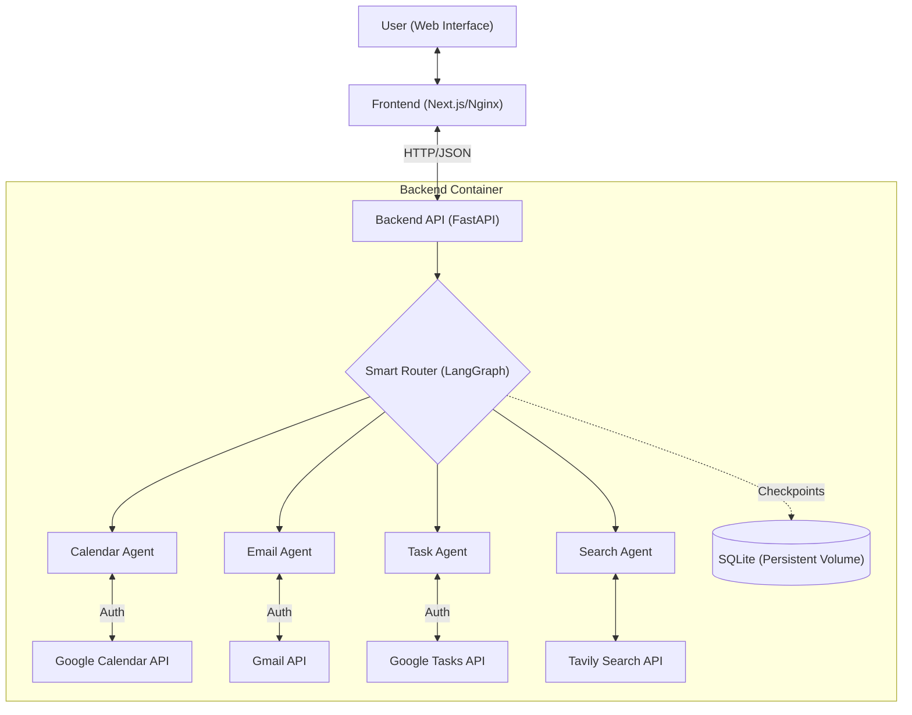

# Personal AI Assistant

A conversational AI assistant web application built with a Microservices Architecture. It connects to Google services (Calendar, Gmail, Tasks) via specialized agents and is orchestrated by LangGraph.

The application helps manage schedules, emails, and tasks while maintaining persistent memory across sessions. It is fully containerized with Docker and designed for enterprise deployment on Red Hat OpenShift.

---

## Architectural Features

- **Microservices Architecture:** Decoupled Frontend (Next.js/Nginx) and Backend (FastAPI/Python) containers.

- **Advanced Agentic Router:** The backend utilizes a "Smart Router" (built with LangGraph) to analyze user requests and delegate tasks to the correct expert: Calendar, Email, Tasks, Search, or Conversational.

- **Specialized Expert Agents:** Each task area is handled by a dedicated agent with its own tools and robust system prompts, ensuring accuracy and adherence to safety protocols.

- **Safe, Multi-Step Workflows:** Critical actions like deleting events, sending emails, or completing tasks require explicit user confirmation, ensuring a safe and predictable user experience.

- **Robust Error Handling:** The assistant is designed to handle API or connection errors gracefully, providing clear feedback to the user (e.g., "I'm having trouble connecting to Google Calendar") instead of crashing.

- **Dynamic Conversation History:** Features a sidebar displaying previous chat sessions. Users can switch between conversations, rename them for better organization, and the assistant maintains context for each session.

- **Persistent Memory:** Uses Docker Volumes and OpenShift PVCs (Persistent Volume Claims) to store conversation history (sqlite) and authentication tokens (token.json) permanently.

- **Conversational AI Core:** Powered by LangGraph and Groq's Llama 3 for stateful, low-latency conversations.

- **Google Calendar Integration:**

  + **Natural Language Understanding:** Parses queries like "tomorrow at 4 PM" or "next week" into precise dates and times, powered by the `parsedatetime` library.
  + **Full Event Management (CRUD):** Can create, read, update, and delete calendar events. It intelligently checks for scheduling conflicts and handles complex requests like "Move my meeting to 5 PM."
  

- **Gmail Integration:**

   + **Intelligent Search & Summarization:** Filters emails by sender, status, keywords, and time range (e.g., "last 2 days") and summarizes their content.

   + **Autonomous Composition:** Can compose and draft emails and replies based on high-level user intent (e.g., "Reply and tell them I'm interested").

   + **Full Email Management:** Can create drafts, send drafts (with user confirmation), archive, and delete emails.


- **Google Tasks Integration:**

   + **Full Task Management:** Allows the user to add, list, update, complete, and delete tasks from their Google Tasks lists.

   + **Natural Language Due Dates:** Understands due dates like "for tomorrow" or "for next Friday" when adding tasks.

- **General Knowledge Q&A:** Uses the Tavily Search API for real-time information retrieval, with mandatory search rule and source citation.

- **Modern Web Interface (Frontend):**

  - Clean, responsive chat interface built with React and styled with Tailwind CSS.

  - Real-time message updates and "Assistant is thinking..." indicators.

  - Sidebar for managing multiple conversations with renaming capabilities.

---

## Architecture Diagram

The assistant operates on a router-based agentic architecture. All user input is first evaluated by a "Smart Router" which then delegates the task to the appropriate specialized expert.



---

## Technologies Used

#### Backend:

- **Framework:** FastAPI

- **AI/Agent Framework:** LangChain & LangGraph

- **LLM:** Groq API (Llama 3 models)

- **Web Server:** Uvicorn

- **Database:** SQLite (for LangGraph checkpoints & chat titles)

- **Key Python Libraries:** google-api-python-client, google-auth-oauthlib, parsedatetime, python-dotenv, Pydantic

#### Frontend:

- **Framework:** Next.js (App Router)

- **Language:** TypeScript

- **UI Library:** React

- **Styling:** Tailwind CSS


#### Infrastructure & DevOps:


- **Containerization:** Docker & Docker Compose

- **Orchestration:** OpenShift (CRC) / Kubernetes

- **Web Server:** Nginx (serving the frontend container)

#### External Services:

- Google Calendar API

- Google Gmail API

- Google Tasks API

- Tavily Search API


---

## Installation & Setup

Prerequisites: `Docker Desktop` installed.

**1. Clone the Repository:**

```bash
git clone https://github.com/berkyalkn/ai-personal-assistant.git
cd ai-personal-assistant
```

**2. Configure Environment & Credentials:**

- **1:  Create a `.env` file in the `server/` directory.**

```bash
GROQ_API_KEY="gsk_YourGroqApiKey"
TAVILY_API_KEY="tvly-YourTavilyApiKey"
```

- **2: Google Credentials:**

   - Download your OAuth 2.0 Client ID JSON from Google Cloud Console.

   - **Important:** Ensure `http://localhost:8090/` is added to "Authorized Redirect URIs" in Google Console.

   - Save the file as `credentials.json` inside the `server/` directory.

   - Create empty files for persistence:

```bash
touch server/token.json server/conversations.sqlite
```

**3. Build & Run (Docker Compose):**

Start the entire system with one command. This will build images, create networks, and mount volumes.

```bash
docker-compose up --build
```


**4. First-Time Authentication (Crucial Step!)**

Since the app runs inside a container, it cannot open your browser automatically.

 - 1: Check the terminal logs. You will see a link saying **"Please visit this URL to authorize..."**.

 - 2: Click the link and login with your Google Account.

 - 3: The redirection will be handled by the mapped port (`8090`), and the generated `token.json` will be saved to your local machine automatically via Docker Volumes.

---

## Cloud Deployment (Red Hat OpenShift)

This project includes production-ready Kubernetes manifests **for Red Hat OpenShift**.

**Prerequisites:** `oc` CLI installed, logged in, and a Docker Hub account.


**1. Push Images to Registry**

```bash
# Backend
cd server
docker build -t youruser/personal-assistant-backend:v1 .
docker push youruser/personal-assistant-backend:v1

# Frontend (Requires Backend URL later, push a placeholder first or skip)
```

**2. Setup Project & Secrets**

```bash
oc new-project personal-assistant

# Create Secrets from your local files
oc create secret generic backend-secrets --from-env-file=server/.env
oc create secret generic google-credentials --from-file=server/credentials.json

# Create Persistent Storage (1Gi) for DB and Tokens
oc apply -f openshift/storage.yaml
```

**3. Deploy Backend & Sync Data**

```bash
# Deploy Backend
 Deploy Backend
oc apply -f openshift/backend.yaml

# Wait for pod to be Running...
# Then copy your local auth token and database to the remote persistent volume
# (Find POD_NAME via `oc get pods`)
oc rsync ./server/data/ POD_NAME:/app/data
```

**4. Build & Deploy Frontend**

The Frontend needs the live Backend URL at build time (Static Export).

- 1. Get Backend Route: `oc get route assistant-backend-route`

- 2. Build Frontend:

```bash
cd client
docker build --build-arg NEXT_PUBLIC_API_URL=http://YOUR_BACKEND_ROUTE_URL -t youruser/personal-assistant-frontend:v1 .
docker push youruser/personal-assistant-frontend:v1
```

- 3 Deploy:

```bash
oc apply -f openshift/frontend.yaml
```

Your assistant is now live on the OpenShift Route!

---


## Example Usage

A quick glimpse of the AI Personal Assistant in action:

